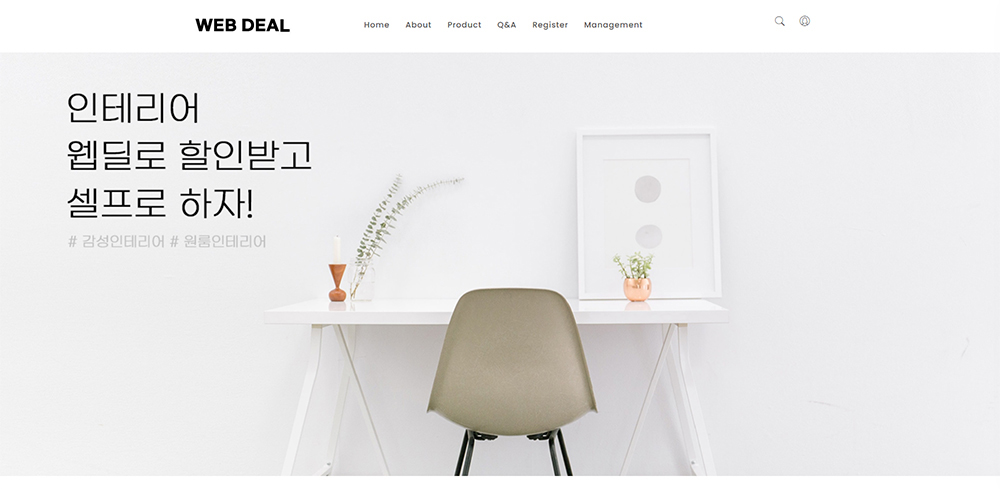
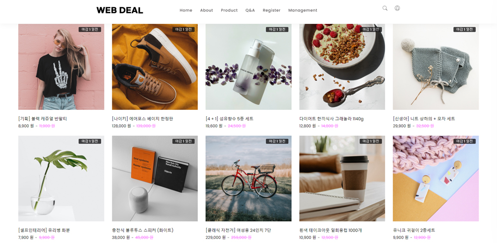
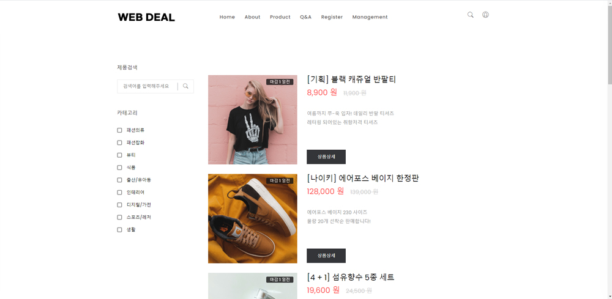
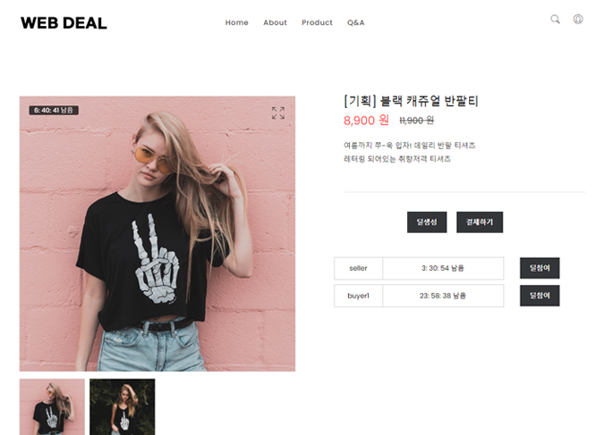
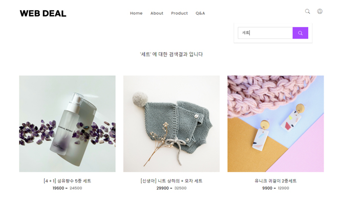
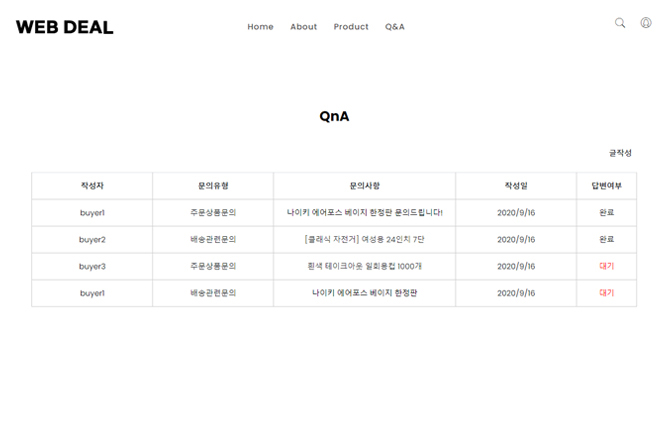
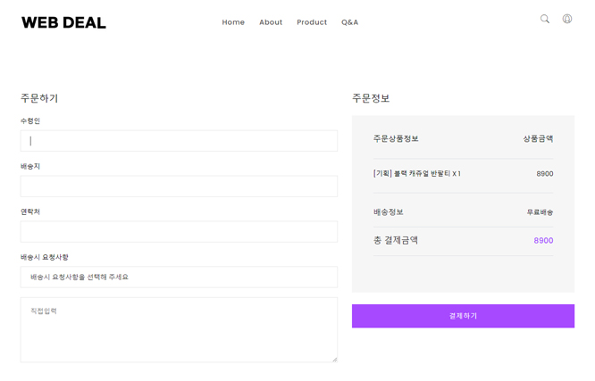
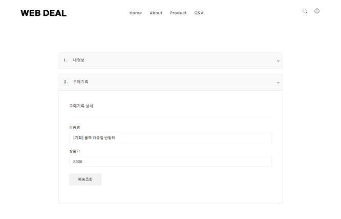
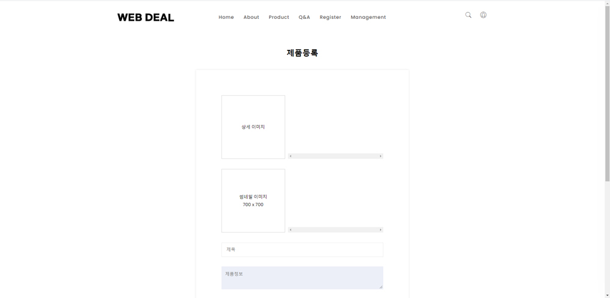
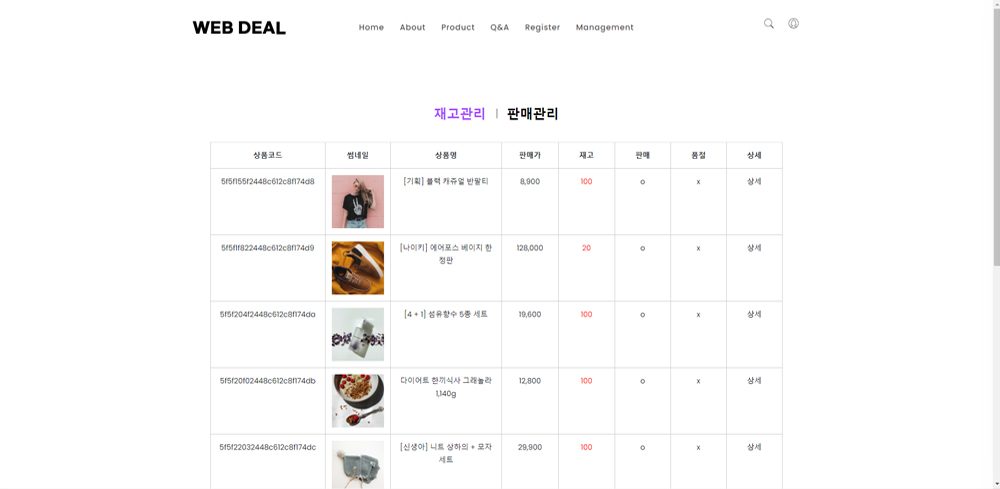

# Web Deal 쇼핑몰 프로젝트
* 2명이상 딜 참여시 공동구매가로 구입이 가능한 쇼핑몰 프로젝트

### 개발 인원 및 기간
* 개발기간 : 2020/07/27 ~ 2020/08/21
* 개발인원 : 김선규, 어성미

### 적용 기술
* React, Redux, Redux-Saga
* Nodejs, Express, mongoDB Atlas
* AWS(EC2/S3), RESTful API

#### 웹사이트 화면
| 홈 (상단) | 홈 (하단) |
| ---| --- |
|  |  |

| 상품전체 | 상품상세 |
| ---| --- |
|  |  |

| 상품검색 | Q&A |
| ---| --- |
|  |  |

| 상품주문 | 내정보, 주문정보 |
| ---| --- |
|  |  |

| 상품등록 | 상품관리 |
| ---| --- |
|  |  |

### 개발사항

No. | 개발사항 | 담당
--- | --- | ---
1 | 로그인 / 회원가입 / 내정보 / ADMIN | 김선규
2 | 상품랜딩 / 상품상세 / 결제상세 | 김선규, 어성미
3 | 상품메인 / 상품등록 / 상품관리 / 상품수정 | 어성미
4 | 회원구매내역 / 판매자 판매내역 | 김선규
5 | 리뷰 / 게시판 | 어성미
6 | 사업자번호인증 / 배송추적 (API) | 어성미
7 | 결제 (API) | 김선규